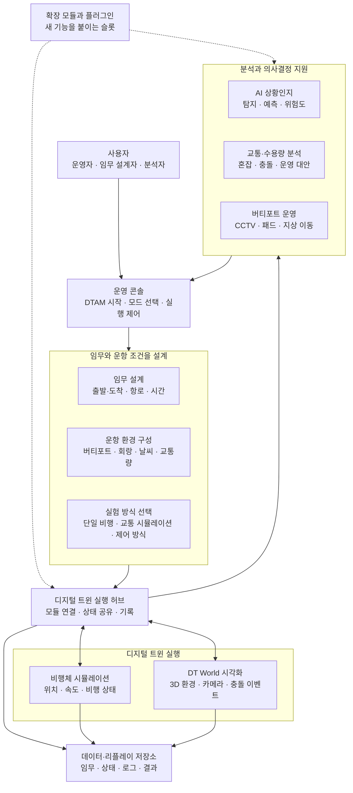

# 0) DTAM Framework 소개용 최상위 아키텍처

## 1. 이 그림의 목적

이 다이어그램은 DTAM Framework를 처음 보는 사람도 아래 질문에 바로 답할 수 있게 만드는 **소개용 그림**입니다.

- DTAM Framework가 무엇을 연결하는가?
- 사용자는 DTAM으로 무엇을 할 수 있는가?
- 어떤 큰 기능 묶음이 있는가?
- 모듈이 많아 보여도 결국 어떤 중심 구조로 묶이는가?

> 이 그림에서는 포트 번호, ICD 번호, 내부 클래스명, WebSocket 같은 구현 세부 용어를 숨기고, **“운영자가 이해할 수 있는 최상위 기능 박스”**만 보여주는 것이 좋습니다.

---

## 2. 한 문장 소개

**DTAM Framework는 임무 설계, 항공교통/운항 환경 설정, 비행체 시뮬레이션, DT World 시각화, AI 상황인지, 버티포트/PSU 운영 지원을 하나의 디지털 트윈 실험 환경으로 연결하는 확장형 AAM/UAM 운영 프레임워크입니다.**

더 순화한 발표용 문장:

> **DTAM은 도심항공교통 운항을 설계하고, 실행하고, 관찰하고, 분석할 수 있는 통합 디지털 트윈 실험 플랫폼입니다.**

---

## 3. 소개용 박스 구성

| 박스명 | 쉬운 설명 | 실제 대응 모듈/구현 |
|---|---|---|
| **운영 콘솔** | 사용자가 DTAM을 실행하고 모든 작업을 시작하는 화면 | OperationModule |
| **임무·운항 설계** | 출발지/도착지, 경로, 기체, 운항 조건을 정하는 영역 | OperationModule, MissionModule |
| **디지털 트윈 실행 허브** | 모든 모듈의 메시지와 상태를 연결하는 중심 | IntegrationHub, DTAMSDK |
| **비행체 시뮬레이션** | 기체가 계획대로 움직이고 상태를 생성하는 영역 | VehicleModule, VFDS/KP2A |
| **DT World 시각화** | 3D/가상환경에서 비행체와 상황을 보여주는 영역 | VisualizationModule, Unreal/AirSim |
| **AI 상황인지** | 영상/상태 데이터를 보고 위험을 탐지·예측하는 영역 | SituationAwareness Plug-in |
| **교통·운항 분석** | 교통량, 충돌, 수용량, 운영 대안을 분석하는 영역 | TrafficSim, PSU Module |
| **버티포트 운영 모니터링** | 버티포트 CCTV, 패드, 게이트, 지상 이동을 보는 영역 | VPO Module |
| **데이터·리플레이 저장소** | 실행 결과, 상태 로그, 임무 파일, 운영환경 데이터를 저장 | DB, MissionModule/data, module data |
| **확장 모듈/플러그인** | 새로운 이해관계자 화면이나 분석 기능을 붙이는 영역 | PlugIn, ExtenstionModule |

---

## 4. 권장 소개용 다이어그램

---

## 5. 그림을 그릴 때의 레이아웃 제안

### 전체 구도

- **좌측**: 사용자와 운영 콘솔
- **상단**: 임무·운항 조건 설계
- **중앙**: 디지털 트윈 실행 허브
- **우측**: 비행체 시뮬레이션과 DT World
- **하단**: AI/교통/버티포트 분석, 데이터 저장소, 확장 모듈

### 레이어 구분

| 레이어 | 그림 표현 | 포함 박스 |
|---|---|---|
| 사용자 레이어 | 사람 아이콘/단일 박스 | 사용자, 운영 콘솔 |
| 설계 레이어 | 밝은 파란색 | 임무 설계, 운항 환경, 실험 방식 |
| 실행 레이어 | 진한 파란색 또는 청록색 | 실행 허브, 비행체 시뮬레이션, DT World |
| 지능·분석 레이어 | 보라색/초록색 | AI 상황인지, 교통 분석, 버티포트 운영 |
| 데이터·확장 레이어 | 회색/민트색 | 데이터 저장소, 플러그인/확장 모듈 |

---

## 6. 용어 순화 가이드

| 기술적 표현 | 소개용 표현 |
|---|---|
| IntegrationHub / StateServer | 디지털 트윈 실행 허브 |
| WebSocket / REST | 모듈 간 연결 통로 |
| ICD Message | 표준 메시지 |
| 4001 Vehicle Status | 비행체 상태 |
| 4101/4102 Camera Frame/Stream | 카메라 영상 |
| CoreServer | 시스템 제어 서버 |
| File DB | 실행 기록 저장소 |
| VehicleModule | 비행체 시뮬레이션 |
| VisualizationModule | DT World 시각화 |
| PlugIn / ExtenstionModule | 확장 기능 |
| VFDS/KP2A | 고정밀 비행 모델 |

---

## 7. 소개용 그림에서 강조할 메시지

1. **DTAM은 단순 시뮬레이터가 아니라 “운항 설계–실행–관찰–분석”을 연결하는 프레임워크다.**
2. **사용자는 하나의 운영 콘솔에서 임무, 환경, 기체, DT World, 플러그인을 제어한다.**
3. **중앙 실행 허브가 각 모듈을 표준 메시지로 연결하므로 기능 확장이 쉽다.**
4. **AI 상황인지, TrafficSim, PSU, VPO 같은 이해관계자별 기능을 플러그인처럼 붙일 수 있다.**
5. **실행 결과는 데이터·리플레이 저장소에 남아 반복 실험과 분석에 사용할 수 있다.**

---

## 8. 이 그림에 넣지 않는 것

소개용 그림에서는 아래 항목을 의도적으로 제외하는 것이 좋습니다.

- 포트 번호
- ICD 번호
- FastAPI, WebSocket, REST 같은 프로토콜명
- 내부 클래스명, 파일명
- 모든 세부 API
- 너무 많은 하위 기능 박스

이 내용은 [02_technical_architecture.md](./02_technical_architecture.md)에 넣습니다.
