# 1) DTAM Framework User Flow 다이어그램 기획안

## 1. 이 그림의 목적

이 문서는 사용자가 DTAM Framework로 **무엇을 하고**, **어떤 순서로 진행하며**, **각 단계가 어떤 모듈과 연결되는지** 보여주기 위한 User Flow 다이어그램 기획안입니다.

요청한 “양식 1” 참고 이미지처럼, 왼쪽에 사용자 역할을 두고 오른쪽에 단계별 박스를 배치하는 **스윔레인/여정 지도 형태**를 권장합니다.

---

## 2. 사용자 역할

| 사용자 | DTAM에서 하는 일 |
|---|---|
| **통합 운영자** | DTAM 시작, 모드 선택, 모듈 실행, 시뮬레이션 재생/정지, 상태 확인 |
| **임무 설계자** | 출발·도착 버티포트, 항로, 기체 수, 운항 시간, 동역학 모델 설정 |
| **시스템 운영자** | Core/State 서버, Mission, Vehicle, Visualization, VFDS 상태 확인 및 제어 |
| **교통/운항 분석자** | TrafficSim, PSU로 교통량·충돌·수용량·대안 분석 |
| **버티포트 운영자** | VPO로 CCTV, 패드, 게이트, 지상 이동, 이벤트 확인 |
| **AI/안전 분석자** | Situation Awareness로 영상 기반 탐지·예측·위험도 확인 |

---

## 3. 사용자에게 보여줄 핵심 흐름

1. **DTAM 시작**
2. **실험 목적 선택**
3. **운항 환경 구성**
4. **임무 설계**
5. **실험 방식 설정**
6. **DT World 실행**
7. **비행/교통 시뮬레이션 실행**
8. **실시간 모니터링과 개입**
9. **AI·교통·버티포트 분석**
10. **결과 저장·리플레이·공유**

---

## 4. 양식 1 스타일 권장 구성

| 레인 | 의미 | 대표 박스 |
|---|---|---|
| **A. 시작과 목적 선택** | 사용자가 DTAM을 켜고 실험 목적을 고름 | A1 DTAM 시작, A2 UAM 모드 선택, A3 모듈 자동 실행 |
| **B. 운항 환경 구성** | 실험할 공간과 조건을 정함 | B1 버티포트/회랑 확인, B2 날씨·교통량 설정, B3 플러그인 선택 |
| **C. 임무 설계** | 어떤 기체가 어디서 어디로 갈지 정함 | C1 기체/임무 생성, C2 경로 계산, C3 비행 모델/제어 방식 선택 |
| **D. 실행과 운영** | DT World를 켜고 시뮬레이션을 수행 | D1 DT World 실행, D2 임무 전달, D3 Play/Pause/속도 제어, D4 이상상황 주입 |
| **E. 모니터링과 판단** | 현재 상태와 위험을 보고 조치 | E1 비행체 상태 확인, E2 AI 상황인지, E3 교통/수용량 분석, E4 버티포트 모니터링 |
| **F. 결과 활용** | 실험 결과를 저장하고 반복 | F1 로그 저장, F2 리플레이, F3 리포트/공유, F4 조건 변경 후 반복 |

---

## 5. 권장 User Flow 다이어그램

```mermaid
flowchart LR
  User["USER\n운영자 · 임무 설계자 · 분석자"]

  subgraph A["A. 시작과 목적 선택"]
    A1["A1 DTAM 시작"] --> A2["A2 UAM 모드 선택"] --> A3["A3 기본 모듈 자동 실행"]
  end

  subgraph B["B. 운항 환경 구성"]
    B1["B1 버티포트·회랑 확인"] --> B2["B2 날씨·교통 조건 설정"] --> B3["B3 필요한 플러그인 선택"]
  end

  subgraph C["C. 임무 설계"]
    C1["C1 기체와 임무 생성"] --> C2["C2 출발·도착·항로 계산"] --> C3["C3 비행 모델·제어 방식 선택"]
  end

  subgraph D["D. 실행과 운영"]
    D1["D1 DT World 실행"] --> D2["D2 임무 전달 및 실행 준비"] --> D3["D3 Play/Pause/속도 제어"] --> D4["D4 이상상황 주입·운영 개입"]
  end

  subgraph E["E. 모니터링과 판단"]
    E1["E1 비행체 상태 모니터링"] --> E2["E2 AI 위험 탐지·예측"] --> E3["E3 교통·수용량 분석"] --> E4["E4 버티포트 운영 확인"]
  end

  subgraph F["F. 결과 활용"]
    F1["F1 실행 로그 저장"] --> F2["F2 리플레이"] --> F3["F3 결과 리포트·공유"] --> F4["F4 조건 변경 후 반복 실험"]
  end

  User --> A1
  A3 --> B1
  B3 --> C1
  C3 --> D1
  D4 --> E1
  E4 --> F1
  F4 -.-> B1
```

---

## 6. 실제 모듈/API 연결표

| 사용자 단계 | 내부 연결 | 주요 모듈/서버 |
|---|---|---|
| A1 DTAM 시작 | 기존 로컬 스택 정리 후 CoreServer 실행 | `Start_DTAM.py`, CoreServerModule |
| A2 UAM 모드 선택 | 운영 콘솔이 모듈 실행 API 호출 | OperationModule |
| A3 기본 모듈 자동 실행 | Mission, Vehicle, VFDS, Server, Visualization 준비 | CoreServer, StateServer, MissionModule, VehicleModule, VisualizationModule |
| B1 버티포트·회랑 확인 | 운영환경 CSV/지도 데이터 조회 | OperationModule, DB, MissionModule/data |
| B2 날씨·교통 조건 설정 | 시뮬레이션 설정 payload 작성 | OperationModule |
| B3 플러그인 선택 | TrafficSim, SituationAwareness, VPO, PSU 실행 | PlugIn, ExtenstionModule |
| C1 기체와 임무 생성 | missionEntries 작성 | OperationModule |
| C2 출발·도착·항로 계산 | MissionModule route planner 호출 | MissionModule |
| C3 비행 모델·제어 방식 선택 | Simple / High Fidelity, Autopilot / Keyboard / Joystick | VehicleModule, VFDS/KP2A |
| D1 DT World 실행 | VisualizationModule이 Unreal/AirSim 실행 | VisualizationModule, DT World |
| D2 임무 전달 및 실행 준비 | 1001, 2001, 3001, 2002 메시지 흐름 | OperationModule, MissionModule, StateServer, VehicleModule |
| D3 Play/Pause/속도 제어 | 1002 메시지와 0003 공통 시간 흐름 | StateServer, VehicleModule, VisualizationModule |
| D4 이상상황 주입·운영 개입 | 5003 이상상황, 5001 조종입력, 5002 카메라 제어 | OperationModule, VehicleModule, VisualizationModule |
| E1 비행체 상태 모니터링 | 4001 차량 상태 수신/표시 | VehicleModule, OperationModule, VisualizationModule |
| E2 AI 위험 탐지·예측 | 4001/4101/4102 기반 객체 탐지·예측 | SituationAwareness |
| E3 교통·수용량 분석 | 교통량, 충돌, 수용량, 의사결정 지원 | TrafficSim, PSU |
| E4 버티포트 운영 확인 | CCTV, 패드, 게이트, 지상 이동 | VPO |
| F1 실행 로그 저장 | 메시지별 세션 DB 저장 | StateServer File DB |
| F2 리플레이 | 저장 데이터/시나리오 결과 재생 | DB, PSU, TrafficSim |
| F3 결과 리포트·공유 | Markdown/HTML/JSON 결과 산출 | PSU, module export |
| F4 반복 실험 | 조건 변경 후 다시 실행 | OperationModule |

---

## 7. 사용자 관점 핵심 메시지

### 사용자가 DTAM으로 할 수 있는 일

- UAM 운항 환경을 구성할 수 있다.
- 버티포트와 회랑을 확인하고 수정할 수 있다.
- 기체별 임무와 경로를 만들 수 있다.
- Simple Dynamics 또는 고정밀 VFDS/KP2A 모델을 선택할 수 있다.
- Autopilot, Keyboard, Joystick 같은 제어 방식을 선택할 수 있다.
- DT World를 실행해 3D 가상환경에서 운항을 볼 수 있다.
- Play/Pause/속도/날씨/이상상황을 바꾸며 실험할 수 있다.
- 차량 상태, 충돌 이벤트, 카메라 영상을 확인할 수 있다.
- AI 상황인지 플러그인으로 위험을 탐지·예측할 수 있다.
- TrafficSim/PSU/VPO로 교통·수용량·버티포트 운영을 분석할 수 있다.
- 결과를 저장하고 리플레이하며 조건을 바꿔 반복 실험할 수 있다.

### 사용자가 직접 해야 하는 일

1. 실험 목적을 정한다.
2. UAM 모드를 선택한다.
3. 운항 환경과 임무 조건을 설정한다.
4. 기체/동역학/제어 방식을 선택한다.
5. DT World를 실행한다.
6. Play를 눌러 실험을 진행한다.
7. 상태와 위험을 보며 필요한 플러그인을 켠다.
8. 결과를 확인하고 반복 실험한다.

### 시스템이 자동으로 해주는 일

- 서버와 기본 모듈 실행
- 모듈 간 메시지 연결
- 임무 요청과 계획 비행 전달
- 공통 시뮬레이션 시간 발행
- 비행체 상태 전파
- DT World 위치 반영
- 충돌/카메라/상태 이벤트 기록
- 세션 로그 저장

---

## 8. User Flow 그림의 시각 디자인 제안

### 권장 배치

- 왼쪽: 사용자 아이콘과 사용자 역할 목록
- 오른쪽: A~F 레인
- 각 레인은 점선 구분선으로 나눔
- 박스는 단계 번호를 크게 표시: A1, A2, B1 …
- 각 박스 하단에는 짧은 보조 설명 1줄만 사용

### 색상 제안

| 레인 | 색상 |
|---|---|
| A 시작 | 진한 파랑 |
| B 환경 구성 | 청록 |
| C 임무 설계 | 보라 |
| D 실행/운영 | 주황 또는 빨강 계열 |
| E 모니터링/판단 | 초록 |
| F 결과 활용 | 회색/남색 |

### 박스 문구 예시

- `A1 DTAM 시작`
- `A2 UAM 모드 선택`
- `A3 모듈 자동 실행`
- `B1 운항 공간 확인`
- `B2 날씨·교통 조건 설정`
- `C1 임무 생성`
- `C2 경로 계산`
- `C3 기체 모델 선택`
- `D1 DT World 실행`
- `D2 임무 전달`
- `D3 시뮬레이션 재생`
- `D4 이상상황 주입`
- `E1 상태 모니터링`
- `E2 AI 위험 분석`
- `E3 교통·수용량 분석`
- `E4 버티포트 확인`
- `F1 로그 저장`
- `F2 리플레이`
- `F3 결과 공유`
- `F4 반복 실험`

---

## 9. User Flow 상세 시나리오 예시

### 단일 비행 실험

1. 운영자가 DTAM을 시작한다.
2. UAM 모드를 선택한다.
3. 운영 콘솔이 기본 모듈을 실행한다.
4. 사용자가 출발/도착 버티포트를 선택한다.
5. MissionModule이 항로를 계산한다.
6. 사용자가 Simple Dynamics 또는 High Fidelity 모델을 고른다.
7. DT World를 실행한다.
8. 임무를 VehicleModule과 VisualizationModule에 전달한다.
9. Play를 누르면 VehicleModule이 4001 상태를 만들고, VisualizationModule이 DT World에 반영한다.
10. AI/교통/버티포트 모듈이 상태와 영상, 교통 상황을 분석한다.
11. 결과를 저장하고 리플레이한다.

### 교통 시뮬레이션 실험

1. UAM 모드를 선택한다.
2. TrafficSim 플러그인을 실행한다.
3. 교통 밀도, 운항 수요, 회랑 조건, 바람 조건을 설정한다.
4. TrafficSim이 다수 항공기의 경로와 상태를 생성한다.
5. PSU가 충돌, 수용량, 병목, 조치 후보를 분석한다.
6. 운영자가 결과를 보고 조건을 바꿔 반복 실험한다.

---

## 10. 그림에 넣으면 좋은 보조 라벨

- “사용자 입력”
- “시스템 자동 처리”
- “실시간 상태 공유”
- “분석/의사결정 지원”
- “저장·리플레이”

이 보조 라벨을 화살표 위에 작게 넣으면, 사용자가 무엇을 누르면 시스템 내부에서 무엇이 자동으로 연결되는지 더 잘 보입니다.
