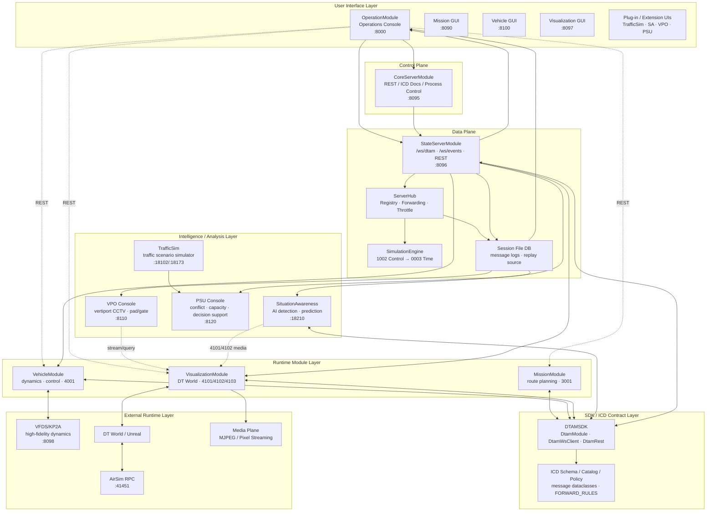
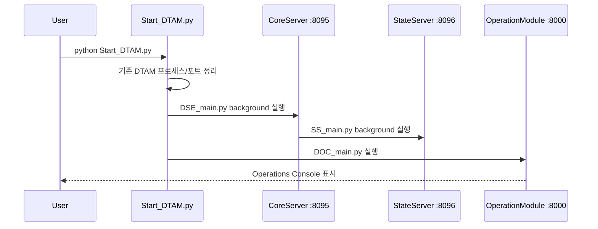
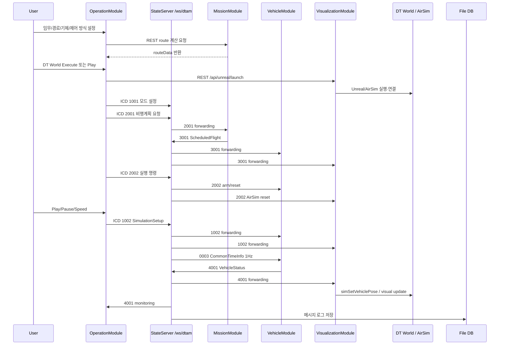
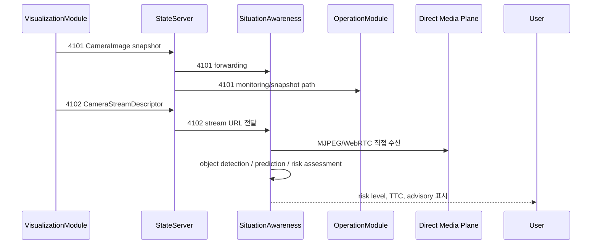
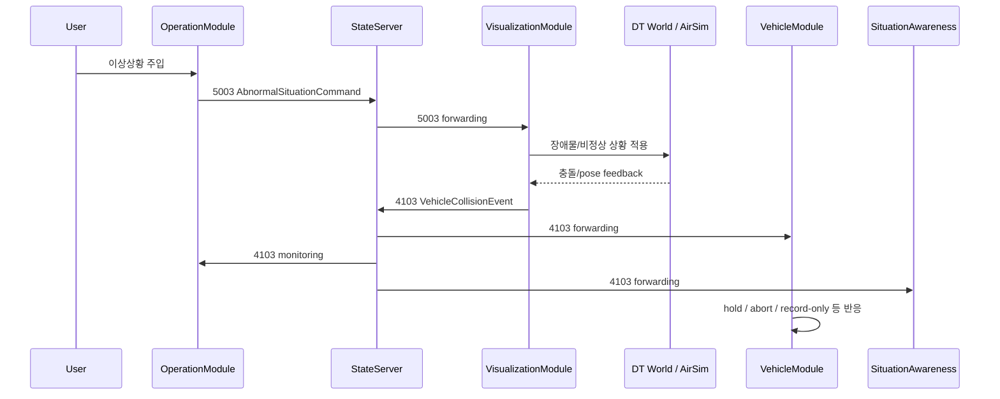

# 2) DTAM Framework 기술 구현 아키텍처

## 1. 이 그림의 목적

이 문서는 DTAM Framework의 실제 구현 구조를 개발자와 통합 엔지니어가 이해할 수 있도록 정리한 기술 아키텍처 문서입니다.

소개용 그림과 달리 이 문서에서는 다음을 명확히 표시합니다.

- 서버와 포트
- 모듈 실행 관계
- DTAMSDK와 ICD 메시지 구조
- REST / WebSocket 연결
- 파일 DB와 데이터 저장소
- Vehicle / Visualization / AI / Plugin / Extension 모듈 간 데이터 흐름

---

## 2. 실제 실행 구조 요약

DTAM Framework는 현재 **2-Tier 실행 구조**를 중심으로 동작합니다.

1. **CoreServerModule, 8095**
   - Control Plane
   - ICD 문서 API
   - 모듈 프로세스 start/stop
   - StateServerModule 자동 기동

2. **StateServerModule, 8096**
   - Data Plane
   - `/ws/dtam` 메시지 버스
   - ICD 메시지 forwarding
   - 파일 DB 로깅
   - 공통 시뮬레이션 시간 발행
   - live monitor / `/ws/events`

OperationModule은 사용자가 보는 운영 콘솔이며, Core/State 서버와 각 모듈을 제어합니다.

---

## 3. 서버·모듈·포트 정리

| 구성요소 | 기본 포트 | 역할 |
|---|---:|---|
| **OperationModule** | `8000` 또는 fallback `8001~8005` | 사용자 운영 콘솔, 모드 선택, 임무/운항 실행 UI |
| **CoreServerModule** | `8095` | Control Plane, ICD docs, process lifecycle |
| **StateServerModule** | `8096` | `/ws/dtam`, `/ws/events`, message forwarding, file DB |
| **MissionModule** | `8090` | 임무 계획, 경로 계산, ScheduledFlight `3001` 생성 |
| **VehicleModule** | `8100` | 비행체 동역학 실행, `4001` VehicleStatus 발행 |
| **VFDS/KP2A** | `8098` | 고정밀 비행 모델 runtime, VehicleModule에서 사용 |
| **VisualizationModule** | `8097` | DT World/Unreal/AirSim 관리, `4101/4102/4103` 발행 |
| **AirSim RPC** | `41451` | Unreal/AirSim 제어 인터페이스 |
| **TrafficSim API** | `18102` | UAM TrafficSim REST API |
| **TrafficSim Tiles** | `18101` | TrafficSim tile server |
| **TrafficSim Frontend** | `18173` | TrafficSim 웹 UI |
| **FlightScheduler** | `18174` | 운항 수요/스케줄러 플러그인 |
| **SituationAwareness** | `18210` | AI 상황인지 플러그인 |
| **VPOModule** | `8110` | 버티포트 운영 모니터링 |
| **PSUModule** | `8120` | PSU 교통/수용량/의사결정 지원 콘솔 |

---

## 4. 기술 레이어 구분

| 레이어 | 구성요소 | 책임 |
|---|---|---|
| **User Interface Layer** | OperationModule, Mission GUI, Vehicle GUI, Visualization GUI, Plug-in UI | 사용자 입력, 상태 표시, 모듈 GUI |
| **Control Plane Layer** | CoreServerModule | ICD 문서, 프로세스 생명주기, StateServer 기동 |
| **Data Plane Layer** | StateServerModule | `/ws/dtam` 메시지 허브, forwarding, DB, 이벤트 스트림 |
| **SDK / Contract Layer** | DTAMSDK, ICD schema, catalog, policy | 메시지 dataclass, role, subscription, REST/WS helper |
| **Runtime Module Layer** | MissionModule, VehicleModule, VisualizationModule | 임무 생성, 비행 상태 생성, DT World 반영 |
| **Intelligence / Analysis Layer** | SituationAwareness, TrafficSim, PSU, VPO | AI 위험 분석, 교통/수용량 분석, 버티포트 모니터링 |
| **Data Layer** | `DB/`, `MissionModule/data`, module data, logs | 세션 로그, 운영환경 CSV, 임무 export, 리플레이 |
| **External Runtime Layer** | Unreal, AirSim, VFDS/KP2A, Pixel Streaming | 3D 월드, 물리/비행 모델, 영상/미디어 plane |

---

## 5. 권장 기술 아키텍처 다이어그램



---

## 6. `/ws/dtam` 메시지 버스 구조

### WebSocket 등록

모듈은 StateServerModule의 `/ws/dtam`에 접속한 뒤 role/source를 등록합니다.

```json
{
  "type": "register",
  "role": "vehicle",
  "source": "VehicleModule"
}
```

서버는 role별 구독 메시지를 응답합니다.

```json
{
  "type": "registered",
  "role": "vehicle",
  "source": "VehicleModule",
  "subscriptions": ["0003", "1002", "2002", "3001", "3002", "3003", "4103", "5001"]
}
```

### 메시지 envelope

```json
{
  "type": "message",
  "mid": "4001",
  "payload": {
    "...": "..."
  }
}
```

카메라 snapshot인 `4101`은 `image_b64`를 함께 보낼 수 있습니다.

---

## 7. ICD 메시지 그룹

| Phase | 대표 메시지 | 의미 | 주요 흐름 |
|---:|---|---|---|
| 0 | `0001`, `0002` | 모듈 설정/상태 | 모듈 heartbeat, registry 갱신 |
| 1 | `1001`, `1003` | 모드/시나리오 설정 | 사용자 설정 → StateServer/Visualization |
| 2 | `2001`, `3001` | 비행계획 요청/계획 비행 | Operation → Mission → Vehicle/Visualization |
| 3 | `2002` | DTAM 실행 (+`scenarioId` 확장 ★) | Operation → Mission/Vehicle/Visualization/SA |
| 4 | `1002` | 시뮬레이션 제어 | Play/Pause/Reset/Speed/Weather |
| 5 | `0003`, `4001`, `4002`, `4101`, `4102`, `4103` | 시간·상태·경고·영상·충돌 | State/Vehicle/Visualization → UI/AI/DB/PSU |
| 6 | `3002`, `3003` | 전략/전술 분리 | Mission/운영 판단 → Vehicle |
| 7 | `5001`, `5002`, `5003`, **`5004`** | 운영자 제어·환경 | 수동 조종, 카메라 제어, 이상상황, 바람 영향 데이터 (★신규) |

---

## ICD Phase 5 — Status Update + Warning

Phase 5는 비행체 실시간 상태(`4001`)와 비행체 경고 이벤트(`4002`)를 함께 다룬다. 4002는 이번 SDK 확장에서 신규 추가되었으며, PSU 도 정식 수신자로 포함된다.

| 메시지 | 발행 주체 | 주요 수신 주체 | 발행 주기 | 의미 |
|---|---|---|---|---|
| `4001` VehicleStatus | Vehicle | Monitoring, Visualization, SituationAwareness, **PSU** | 고빈도 (10~50Hz) | 비행체 위치/자세/속도 등 실시간 상태 |
| `4002` VehicleWarningEvent | Vehicle | Monitoring, SituationAwareness, **PSU** | event-based | 비행체 자체에서 발생한 경고/이상 이벤트 |
| `4101` CameraImage | Visualization | Monitoring, SituationAwareness | snapshot | 카메라 snapshot |
| `4102` CameraStreamDescriptor | Visualization | Monitoring, SituationAwareness | stream desc | 직접 media stream descriptor |
| `4103` VehicleCollisionEvent | Visualization | Vehicle, Monitoring, SituationAwareness | event | 충돌 이벤트 |

### 4002 VehicleWarningEvent — key fields

- `vehicleId` — 경고 발생 비행체 식별자
- `eventId` — 경고 이벤트 고유 ID (후속 `2001` 재계획 요청의 `triggeringEventId` 로 참조됨)
- `category` — 경고 분류 (예: `SUBSYSTEM`, `ENVIRONMENT`, `OPERATIONAL`)
- `subsystem` — 영향받는 서브시스템 (예: `BATTERY`, `MOTOR`, `NAV`)
- `eventType` — 이벤트 종류 (예: `LOW_BATTERY`, `OVERHEAT`)
- `severity` — 심각도 (예: `INFO`, `WARNING`, `CRITICAL`)
- `recommendedAction` — 권고 조치 (예: `DIVERT`, `LAND_IMMEDIATELY`)
- `detectedValue` / `threshold` — 측정값과 임계값

---

## Role: PSU (Provider of Services for UAM)

PSU(Provider of Services for UAM)는 UAM 교통 흐름과 회랑(corridor) 운영을 관리하는 운영 서비스 사업자 역할이다. DTAM Framework에서는 `ExtenstionModule/PSUModule` 로 구현되며, conflict/capacity 분석, 회랑 폐쇄 의사결정, 재계획 트리거 등을 담당한다.

- **PSUModule(DtamModule)** — DTAMSDK `DtamModule` 을 상속하는 PSU role 기본 클래스
- role = `psu`, 수신 ICD: `4001 VehicleStatus`, `4002 VehicleWarningEvent`, `5004 WindEffectData`
- 4001 로 비행체 실시간 상태를 받아 회랑/capacity 모니터링에 사용
- 4002 로 비행체 측 이상 이벤트를 직접 수신하여 재계획 의사결정에 활용
- 5004 로 운영자가 주입한 바람 영향 데이터를 수신하여 회랑 영향 분석에 활용
- 전술 개입(tactical intervention)이 필요할 경우 `3003 TacticalSeparation` 을 **직접 발행** (즉시 land/directTo)
- 전략 재계획이 필요할 경우 `2001 FlightPlanRequest` 를 `triggeringEventId` 와 함께 발행 (보조 경로, strategic re-plan trigger)

---

## 8. 실제 Forwarding 정책 요약

★ 이번 SDK 확장으로 `4001` 의 수신자에 **psu** 가 추가되었고, 신규 메시지 `4002` 의 forwarding 이 정의되었다. 이후 후속 변경으로 신규 메시지 `5004` (wind_effect_data) 가 추가되고 `3003` 수신자에 **mission** 이 추가되었다.

| 메시지 | 발행 주체 | 주요 수신 주체 | 의미 |
|---|---|---|---|
| `0002` | 각 모듈 | Monitoring | 모듈 상태 heartbeat |
| `0003` | StateServer | Vehicle, Visualization | 공통 시뮬레이션 시간 |
| `1001` | Operation | StateServer | 모드 설정 |
| `1002` | Operation | Vehicle, Visualization, StateServer | 재생/정지/속도/날씨 제어 |
| `1003` | Operation | StateServer, Visualization | 시나리오 설정 |
| `2001` | Operation / **PSU / UAO** | Mission | 비행계획 요청 (재계획 트리거 포함) |
| **`2002`** | Operation | Mission, Monitoring, Vehicle, Visualization, SituationAwareness | 실행 명령 (**+scenarioId (S1\|S2\|S3) 확장** ★ — 라우팅 변경 없음) |
| `3001` | Mission | Vehicle, Visualization | 계획 비행 등록 |
| `3002` | Mission | Vehicle | 전략 분리 명령 |
| **`3003`** | Mission / **PSU (직접 발행)** | **Vehicle, Mission** ★변경 | 전술 분리 / 즉시 명령 (land/directTo) |
| **`4001`** | **Vehicle** | **Monitoring, Visualization, SituationAwareness, PSU** ★ | **비행체 상태 (PSU 신규 수신)** |
| **`4002`** | **Vehicle** | **Monitoring, SituationAwareness, PSU** ★신규 | **비행체 경고 이벤트** |
| `4101` | Visualization | Monitoring, SituationAwareness | 카메라 snapshot |
| `4103` | Visualization | Vehicle, Monitoring, SituationAwareness | 충돌 이벤트 |
| `5001` | Operation | Vehicle | 수동 조종 입력 |
| `5002` | Operation | Visualization | 카메라 제어 |
| `5003` | Operation | Visualization | 이상상황/장애물 주입 |
| **`5004`** | **Operation** | **Vehicle, Visualization, PSU** ★신규 | **바람 영향 데이터** |

### SDK FORWARD_RULES (정식 정의 — `DTAMSDK/dtam_client/policy.py`)

```
4001 → [monitoring, visual, situation_awareness, psu]    # psu 신규
4002 → [monitoring, situation_awareness, psu]            # 신규 메시지
3001 → [vehicle, visual]
3002 → [vehicle]
3003 → [vehicle, mission]                                 # mission 추가 (PSU 직접 발행 대응)
2001 → [mission]
2002 → [mission, monitoring, vehicle, visual, situation_awareness]  # +scenarioId 확장, 라우팅 변경 없음
1001 → [sim_state]
1002 → [vehicle, visual, sim_state]
1003 → [sim_state, visual]
0003 → [vehicle, visual]
4101 → [monitoring, situation_awareness]
4103 → [vehicle, monitoring, situation_awareness]
5004 → [vehicle, visual, psu]                             # 신규 메시지 (wind_effect_data)
```

---

## 2001 FlightPlanRequest — re-plan trigger extension

`2001 FlightPlanRequest` 는 기존 Operation(user) 발행에 더해, **PSU(회랑 충돌 회피)** 와 **UAO(배터리/이상 → 대체 vertiport)** 가 재계획 트리거로 발행할 수 있도록 확장되었다.

- **Senders extended**: `user | psu | uao`

신규 optional 필드 (재계획 컨텍스트 전달용):

| 필드 | 타입 | 의미 |
|---|---|---|
| `flightPlanNumber` | string (optional) | 재계획 대상 기존 비행계획 번호 |
| `reasonCode` | string (optional) | 재계획 사유 코드 (예: `CORRIDOR_CONFLICT`, `LOW_BATTERY`, `WX_DIVERT`) |
| `triggeringEventId` | string (optional) | 재계획을 유발한 이벤트 ID (`4002.eventId` 등과 연계) |
| `arrivalVertiportHint` | string (optional) | 권고/대체 도착 vertiport ID |

---

## 2002 DtamExecute — scenarioId extension

`2002 DtamExecute` 는 optional 필드 `scenarioId` (`"S1" | "S2" | "S3"`) 를 가지도록 확장되었다. Operation Console 이 실행 시점에 현재 시나리오 식별을 전달하면, Vehicle 은 `on_dtam_execute` 에서 이 값으로 동작 모드를 분기한다 — S1 정상 / S2 바람 영향 수용 모드 / S3 배터리 열화 프로필 활성화 + UAO 겸업 판단 로직 무장 (**UAO 역할은 별도 모듈이 아니라 VehicleModule 이 겸업** — 운항사 판단 로직이 Vehicle 모듈 안에 포함, 사용자 확정). `scenarioId` 가 None 이면 wire 에서 omit 되어 기존 payload 와 호환되며 (`from_wire()` 는 unknown key 무시), forwarding 규칙은 변경되지 않는다 — Vehicle 은 기존 2002 수신자.

---

## 9. 핵심 실행 시퀀스

### 9.1 시스템 시작



### 9.2 단일 비행 임무 실행



### 9.3 영상·AI 상황인지 흐름



### 9.4 충돌/이상상황 흐름



---

## 10. 모듈별 기술 책임

### OperationModule

- 사용자 운영 콘솔
- UAM 모드 선택
- 전체 모듈 run/stop/open GUI
- 운항 환경 편집
- 임무 경로 요청
- ICD `1001`, `1002`, `2001`, `2002`, `5003` 송신
- DT World launch 요청
- Vehicle/Visualization runtime readiness 확인

### MissionModule

- Mission planner GUI/API
- route planner
- vertiport/waypoint/DEM/groundmap 데이터 사용
- Mission ICD export/save
- 수신 ICD: `2001`, `2002`, `3003` (3003 은 PSU 직접 발행분 수신 — 전술 개입 인지 및 후속 계획 반영)
- `2001` 수신 후 `3001 ScheduledFlight` 생성/전송

### VehicleModule

- `3001` 임무 등록
- simple dynamics / manual dynamics / VFDS-KP2A provider routing
- `0003`, `1002`, `2002` 기반 시뮬레이션 시간/실행 상태 반영
- `5001` 수동 조종 입력 처리
- `4103` 충돌 이벤트에 따른 hold/abort/record 반응
- `4001 VehicleStatus` 송출

### VisualizationModule

- Unreal/DT World launch
- AirSim RPC connect
- `4001`을 AirSim pose로 반영
- `1002` 날씨/바람/재생 상태 반영
- `2002` 실행 reset
- `3001` mission guide 반영
- `5002` 카메라 제어
- `5003` 이상상황/장애물 주입
- `4101` camera snapshot, `4102` media descriptor, `4103` collision event 송출

### SituationAwareness

- `4001` 비행체 상태 수신
- `4101` snapshot 또는 `4102` media stream 기반 영상 처리
- 객체 탐지, 예측, 안전 지표, 위험도 산출
- 웹 UI로 risk/advisory 표시

### TrafficSim

- 대량 교통 시나리오 생성/실행
- 버티포트/회랑 기반 route planning
- 교통량, 바람, 규칙, 회랑 폐쇄, congestion 등 시뮬레이션
- history/log/export 제공

### PSU Module

- 운영 의사결정 지원 콘솔
- traffic/conflict, flow/capacity, decision support, replay/report
- live 4001은 StateServer/Operation cache 또는 DB를 polling
- Operation dispatch는 안전상 dry-run preview 범위

### VPO Module

- 버티포트 운영 모니터링
- CCTV rail, 2D layout, pad/gate 상태, queue, weather, alerts
- Visualization의 VPO camera stream을 필요 시 조회

---

## 11. 데이터 저장 구조

| 저장소 | 위치 | 내용 |
|---|---|---|
| StateServer File DB | `DB/ServerStart_*` | ICD 메시지 세션 로그, latest, jsonl |
| 운영환경 DB | `DB/operational_environment` | active/default vertiport, corridor, basestation CSV |
| Mission data | `MissionModule/data` | waypoint, vertiport, mission_exports, groundmaps |
| Vehicle data | `VehicleModule/data` | runtime/config/export/log |
| Visualization config/runtime | `VisualizationModule/data`, `VisualizationModule/runtime` | vm_config, Unreal, AirSim client, media/runtime assets |
| TrafficSim data/log | `PlugIn/TrafficSim/data`, `PlugIn/TrafficSim/log` | default/custom network, events, tracks, metrics |
| PSU scenario data | `ExtenstionModule/PSUModule/data` | scenario, decision support, replay/report source |

---

## 12. 기술 그림에서 강조할 설계 포인트

1. **Control Plane과 Data Plane을 분리했다.**
   - CoreServer는 프로세스와 문서 중심
   - StateServer는 실시간 메시지와 데이터 중심

2. **모듈 간 기능 데이터 교환은 StateServer `/ws/dtam`과 ICD 메시지가 기준이다.**

3. **DTAMSDK가 모듈 작성 규칙을 표준화한다.**
   - role
   - heartbeat
   - dataclass schema
   - send/on_receive
   - forwarding policy

4. **고빈도 데이터는 경로를 분리한다.**
   - 4001/4101은 throttle/latest-only 처리
   - 실시간 영상은 4102 descriptor + direct media plane 권장

5. **분석/확장 기능은 core runtime과 분리된 플러그인/확장 모듈로 붙인다.**

6. **실행 결과는 파일 DB와 module data에 남아 리플레이·분석·보고서로 재사용된다.**

---

## 13. 기술 다이어그램 제작 팁

### 한 장에 넣을 항목

- OperationModule
- CoreServerModule
- StateServerModule
- DTAMSDK / ICD Contract
- MissionModule
- VehicleModule
- VisualizationModule
- Unreal/AirSim/VFDS
- SituationAwareness / TrafficSim / PSU / VPO
- File DB / Mission Data / Operational Environment

### 한 장에서 줄일 항목

- 모든 REST endpoint
- 모든 HTML/JS 파일
- 세부 class/function
- plugin별 모든 내부 API
- 데이터 파일 하나하나

### 표현 규칙

- **실선**: 필수 실행 경로
- **점선**: 선택 플러그인/확장 경로
- **두꺼운 선**: `/ws/dtam` 표준 메시지 경로
- **얇은 선**: REST 관리/API 경로
- **별도 색상 선**: media plane 또는 external runtime 경로

---

## 14. 근거 파일

대표 근거 파일은 다음과 같습니다.

- `D:\DTAMFramework\Start_DTAM.py`
- `D:\DTAMFramework\DEPENDENCIES.md`
- `D:\DTAMFramework\IntegrationHub\README.md`
- `D:\DTAMFramework\IntegrationHub\CoreServerModule\DSE_main.py`
- `D:\DTAMFramework\IntegrationHub\CoreServerModule\app\server.py`
- `D:\DTAMFramework\IntegrationHub\CoreServerModule\app\routes\process.py`
- `D:\DTAMFramework\IntegrationHub\CoreServerModule\app\model\message.py`
- `D:\DTAMFramework\IntegrationHub\StateServerModule\SS_main.py`
- `D:\DTAMFramework\IntegrationHub\StateServerModule\app\server.py`
- `D:\DTAMFramework\IntegrationHub\StateServerModule\app\routes\ws_dtam.py`
- `D:\DTAMFramework\IntegrationHub\StateServerModule\app\routes\push.py`
- `D:\DTAMFramework\IntegrationHub\StateServerModule\app\services\hub.py`
- `D:\DTAMFramework\IntegrationHub\StateServerModule\app\services\engine.py`
- `D:\DTAMFramework\IntegrationHub\StateServerModule\app\database\file_db.py`
- `D:\DTAMFramework\DTAMSDK\dtam_client\module.py`
- `D:\DTAMFramework\DTAMSDK\dtam_client\_ws_client.py`
- `D:\DTAMFramework\DTAMSDK\dtam_client\rest.py`
- `D:\DTAMFramework\DTAMSDK\dtam_client\policy.py`
- `D:\DTAMFramework\DTAMSDK\dtam_client\role_modules.py`
- `D:\DTAMFramework\OperationModule\README.md`
- `D:\DTAMFramework\OperationModule\app\services\dtam_execution_service.py`
- `D:\DTAMFramework\MissionModule\README.md`
- `D:\DTAMFramework\VehicleModule\README.md`
- `D:\DTAMFramework\VehicleModule\app\services\integrated_service.py`
- `D:\DTAMFramework\VisualizationModule\README.md`
- `D:\DTAMFramework\VisualizationModule\app\services\manager.py`
- `D:\DTAMFramework\PlugIn\SituationAwareness\README.md`
- `D:\DTAMFramework\PlugIn\TrafficSim\app\sim_core.py`
- `D:\DTAMFramework\ExtenstionModule\PSUModule\README.md`
- `D:\DTAMFramework\ExtenstionModule\VPOModule\README.md`

---

## Scenarios — see docs/scenarios/

S1 정상 / S2 PSU 회랑 충돌 회피 / S3 UAO 배터리 → 대체 vertiport 3개 시나리오의 상세 시퀀스는 `docs/scenarios/{README,S1_nominal,S2_psu_replan,S3_uao_battery_alt_vertiport}.md` 단일 source 에서 관리. 본 기술 아키텍처 문서는 시나리오 흐름을 중복 기술하지 않음.

→ [docs/scenarios/README.md](../scenarios/README.md)
